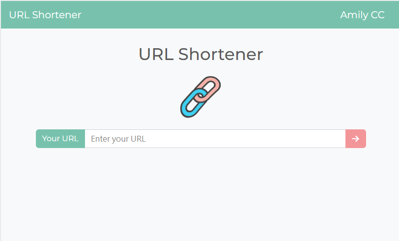

# 我縮你的網址！



## 介紹

將你冗長的網址，縮短成隨機短網址！

### 功能

- 輸入你的網址
- 生成新的短網址
- 一鍵複製
- 任何地方都可以使用

## 開始使用

### 線上使用

- herokuapp https://stark-gorge-80531.herokuapp.com/

### 載到本地

1. 請先確認有安裝 node.js 與 npm
2. 將專案 clone 到本地
3. 在本地開啟之後，透過終端機進入資料夾，輸入：

   ```bash
   npm install
   ```

4. 安裝完畢後，繼續輸入：

   ```bash
   npm run start
   ```

5. 若看見此行訊息則代表順利運行，打開瀏覽器進入到以下網址

   ```bash
   Listening on http://localhost:3000
   ```

6. 若欲暫停使用

   ```bash
   ctrl + c
   ```

## 開發工具

- Node.js 16.14.0
- Express 4.17.1
- Express-Handlebars 4.0.2
- Bootstrap 5.0.2
- Font-awesome 5.8.1no
- body-parser 1.20.0
- mongoose 6.6.0
- jquery 3.6.1
- jsdom 20.0.0
- method-override 3.0.0
- nodemon 2.0.19

## 雲端佈署

- Heroku
